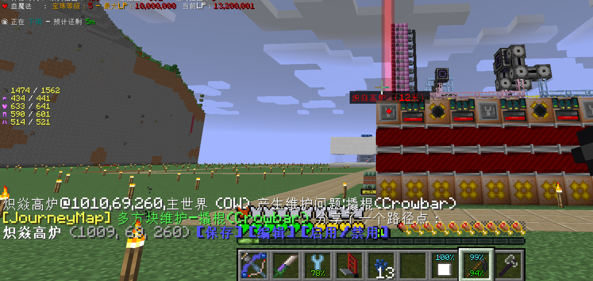
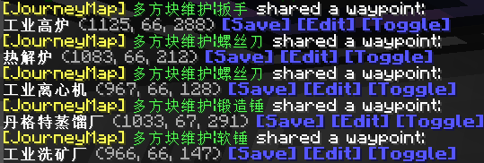

# Random Mixins for GTNH

任何修改都可以在`config/mygtnh.cfg`里关闭

### 功能

这个 Mod **不会阻止**未安装的玩家加入服务器 客户端服务端均为可选

C:客户端需装 S:服务端需装

- (S)wecui_spam: 移除 worldedit 后台握手刷屏
- (S)warp_eff: 移除神秘扭曲负面效果，但保留扭曲值
- (S)nu_nor: 阻止舔治愈斧子时扣营养
- (S)tank_debuff: 减少搬超级缸的 debuff 时间
- (S)multi_notify: 多方块维护事件提醒
- (S)multi_notify_url: 多方块维护事件 HTTP 回调
- (S)gt_lang: 强制 GT 在服务端上使用指定语言文件
- (C)gt_pollute: 移除 GT 污染客户端渲染 (提高 fps )，但保留污染 debuff
- (C)gt_cape_url:
  自定义披风 ([CustomSkinAPI](https://github.com/xfl03/CustomSkinLoaderAPI/blob/master/CustomSkinAPI/CustomSkinAPI-zh_CN.md))
- (C)mc_font: 修复汉字粗体渲染 (**_乙醚冲击_**[MC-76356](https://bugs-legacy.mojang.com/browse/MC-76356))
- (C)glass_map: 隐藏 journeymap/serverutilities 小地图玻璃渲染
- (C)gc_armor: 隐藏 galacticraft 丑陋的热力外套渲染
- (C)adv_pack: 隐藏探险背包渲染
- (C)bop_trail/gs_cape: 移除阻碍游戏启动的 HTTP 请求
- (C/S)gc_cape/gtpp_cape/gt_cape/de_con/de_pic/bot_con/aroma_cape/journey_stat/mc_stat: 移除无用 HTTP 请求
- (C/S)gg_meme: 换掉 goodgenerator 合成表电压烂梗
- (C/S)se_teleport: 禁用太空电梯发射功能(用于不上天挑战) 默认不禁用

### 指令 (均需要开启作弊)

- `/mygtnh dump infusion` 导出所有注魔配方到 csv 文件
- `/mygtnh maintenance` 列出当前需维护的多方块
- `/mygtnh tick 200` 立即向后步进 200 游戏刻 (类似 carpet)
- `/mygtnh tps 20.0` 改变游戏 TPS (类似 carpet)
- `/mygtnh save` 关闭/开启世界自动保存 (类似高版本`/save-on` `/save-off`) 可与 tps 命令配合使用 避免加速 TPS
  时频繁的自动保存导致卡顿

### 画廊

